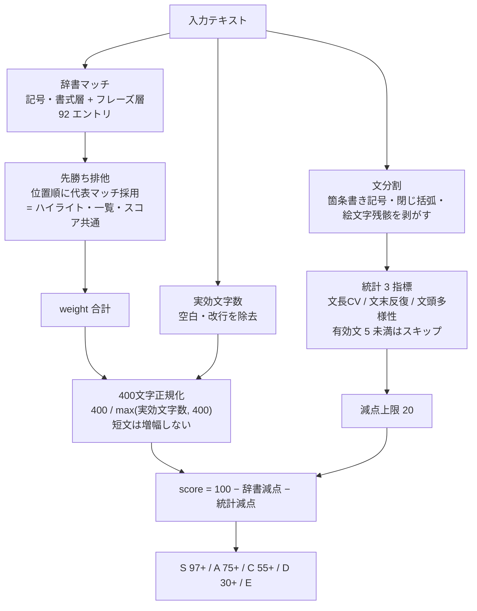

# 薄っぺらな戯（usuppera）

文章を貼り付けると「AI っぽい定型文の薄っぺらさ」を採点するツール。記号の癖・定型句・文体の統計だけで動く決定論的な検出器で、外部 API・LLM・形態素解析は使わない。テキストはどこにも送信されない。

## 検出フロー



## 3 層構成（dictionary.ts）

1. **記号・書式層**: em ダッシュ、`**太字ラベル:**` 箇条書き、行頭絵文字など、LLM 出力の書式の残骸。人間はほぼ書かない形なので高 weight で決め手にする
2. **フレーズ辞書層**: ハイプ・誇張 / 定型評価語 / テンプレ導入・結び / 事なかれ・両論併記 / 冗長構文 / 行頭接続詞の 6 カテゴリ。表層の部分一致で、意味的な曖昧マッチはしない
3. **統計層**: 文長の変動係数・文末 3 文字の反復率・文頭 2 文字の多様性。辞書に 1 件もヒットしない文章でも、文体の均一さだけで減点が付く

## 設計判断

- **単語 1 語のエントリは持たない**。「活用」「効率的」のような日常語は人間の実務文書も踏み、偽陽性源にしかならない。「近年、」「注意が必要です」「解説します」も同じ理由で不採用
- **重なるマッチは位置順の先勝ちで 1 件に絞る**。意味的な重複排除ではなく、減点を常に保守側（少なくなる側）に倒しつつ、検知数・一覧・ハイライトの数字を一致させるための排他
- **判定と正規化の分母は空白を除いた実効文字数**。改行の水増しでスコアを薄める入力を無効化する
- **統計層は文頭の箇条書き記号・閉じ括弧・絵文字を剥がしてから測る**。剥がさないとレイアウト（記号は記号・書式層の担当）を二重に罰してしまう。3 指標は同一原因で相関しやすいため合計減点に上限を置く
- **満点近辺はランク S「逆に怪しいです」**。人間の文章でも多少は辞書を踏むはず、の逆張り
- 絵文字の grapheme 完全対応（国旗の検出、ZWJ シーケンスの完全ハイライト）とゼロ幅スペースによる水増し対策は PoC スコープ外として割り切っている

weight・閾値の具体値は dictionary.ts に意図つきで置いてある。ここには写さない。

## 出典

- https://github.com/textlint-ja/textlint-rule-preset-ai-writing （フレーズ語彙の移植元）
- https://github.com/gonta223/humanizer-ja
- https://github.com/mrtomdev/truthlens （統計層の設計元）

## ファイル構成

```
usuppera/
├── index.html      エントリ（title / description は一覧自動生成に使われる）
├── App.tsx         UI・ハイライト表示・採点結果
├── dictionary.ts   検知辞書・統計層・スコアリング（純粋関数）
├── main.tsx        React マウント
├── og.tsx          OGP 画像用ミニチュア
└── styles.css      ツール固有スタイル
```
